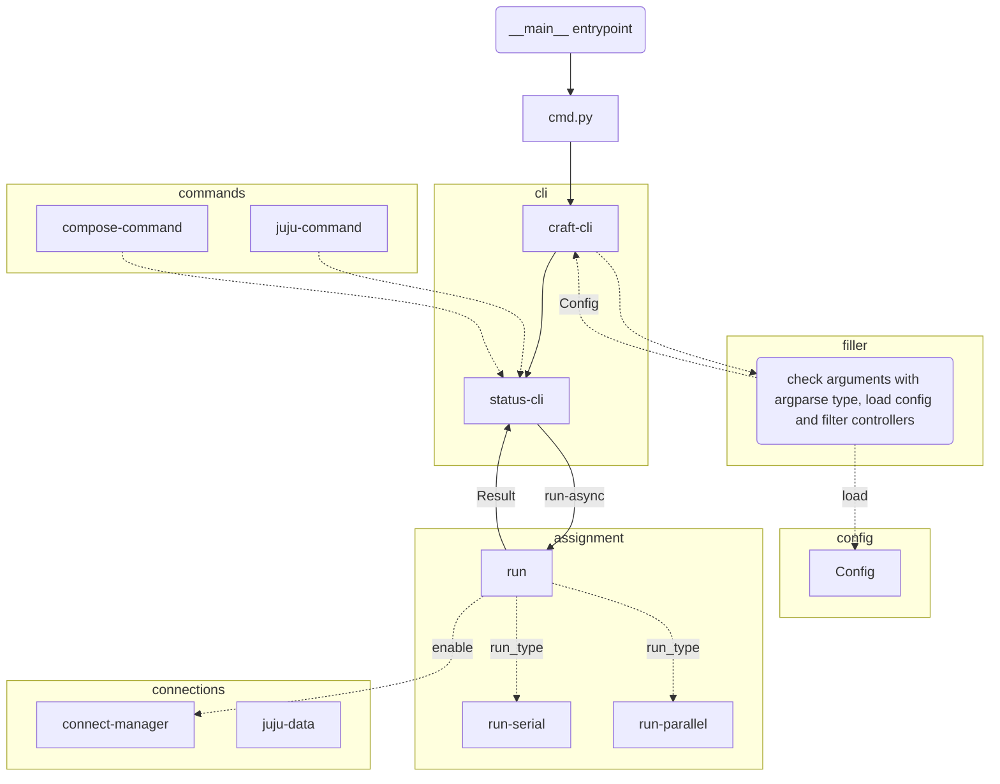
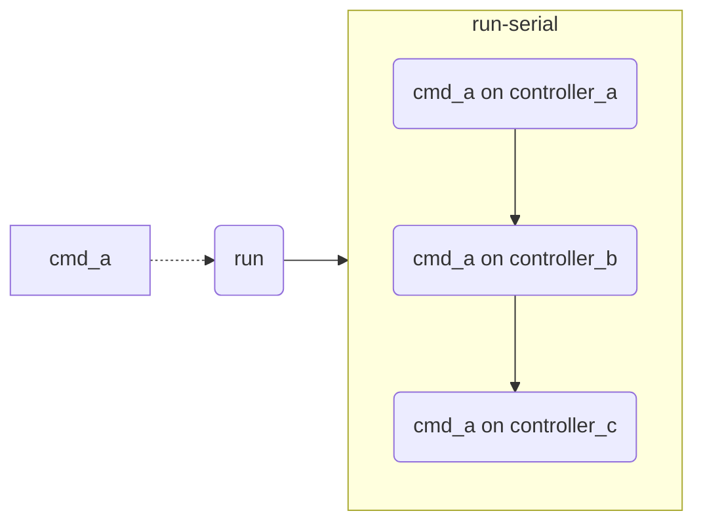
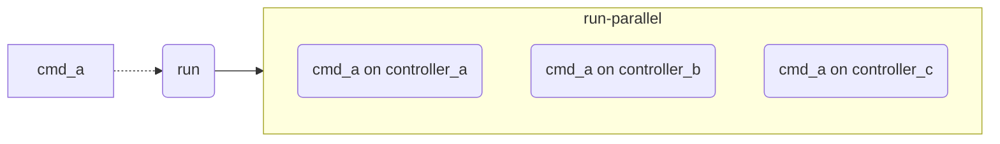
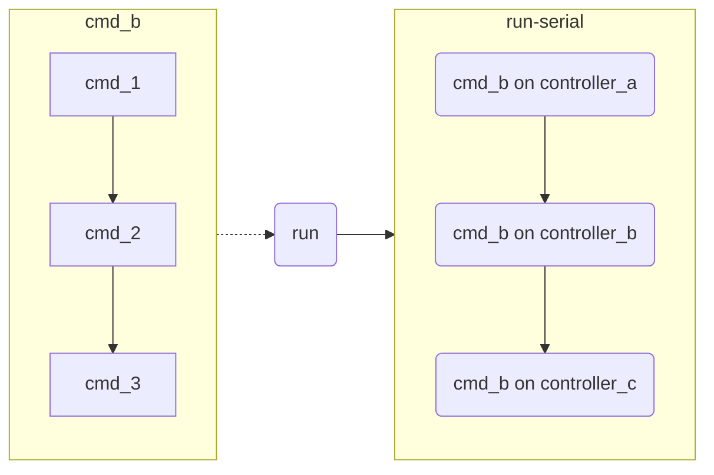
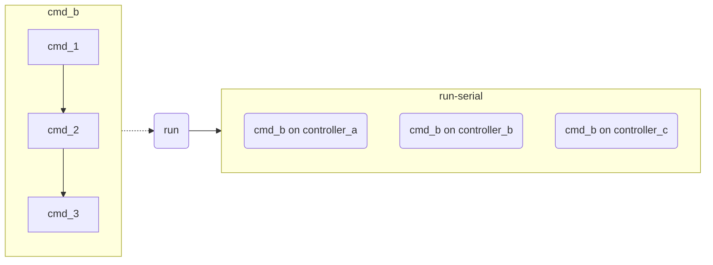

# Architecture

The tools contain multiple parts:

- Connection
- Config
- Identidy
- Assignment
- Juju command
- CLI command




## Connection

The connection is the manager that we handle the

- ssh tunnel
- ssh shuttle
- JAAS
- juju controller's connection

The use of connection manager should not care about the details inside. The connection manager should automatically build connection and clean it for the user. This is like the Database connection but connect to remote juju controllers.


## Config

The config path right now is under environment variable `MULTIJUJU_DATA` or `~/.local/share/multijuju` in default.


===details of config here===


## Identidy

===details of identidy here===


## Juju command

The package *commands(juju command)* is the minimum scope juju command that can run on a single juju controller, which may be a read only command like `juju status` or `juju models`.

- The package should not care the connection to the juju controller that will be build by *connection manager* and become the parameter of it.
- The command should not care the details if user want to run multiple commands on multiple controllers. This should be handle by the *assignment* package.
- User should have ability to combind multiple base juju commands, which will run serially, to become a compose juju command that can run on a single controller. It will also becomee a juju command.


## CLI command

- The Command Line Interface that build by the canonical's *craft-cli*. The CLI command only care the basic workflow like parse arguemnts, read config and confirm running.
- The CLI should not include connection manager and identidy. The only business packages can be imported is assignment and config.


## Assignment

This may become the most complex part of the tool. It will handle the logic how to run multiple juju commands on multiple juju controllers serially or parallelly.


If we have two commands `cmd_a`, which is a JujuCommand, and `cmd_b`, which is a ComposeCommand, will execute on three different controllers: `controller_a`, `controller_b` and `controller_c`


```python

# run function in assignment package
def run(command: Union[JujuCommand, JujuComposeCommand], **args):
    ...
```

*Run JujuCommand serially*



*Run JujuCommand parallelly*



*Run ComposeCommand serially*



*Run ComposeCommand parallelly*


