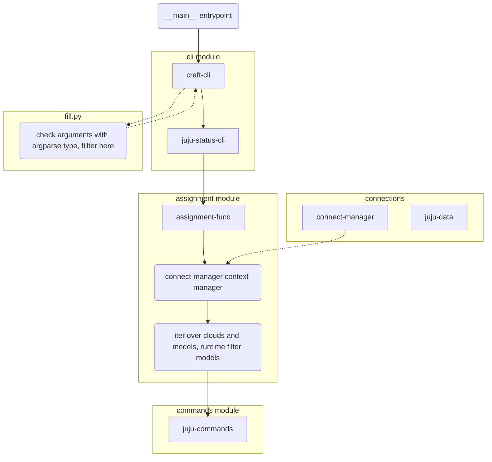

# Workflow

- **__main__ entrypoint**:
    - setup cli and exit
- **fill.py**
    - all filter function will put here
- **cli module**
    - Only include setup cli command & argparse.
- **assignment module**
    - High level business logic.
    - The connection should be handled here.
- **connect manager**
    - JAAS/ssh tunnel/sshuttle connection manager
- **commands module**
    - The command should only consider how to working with the juju controller.
