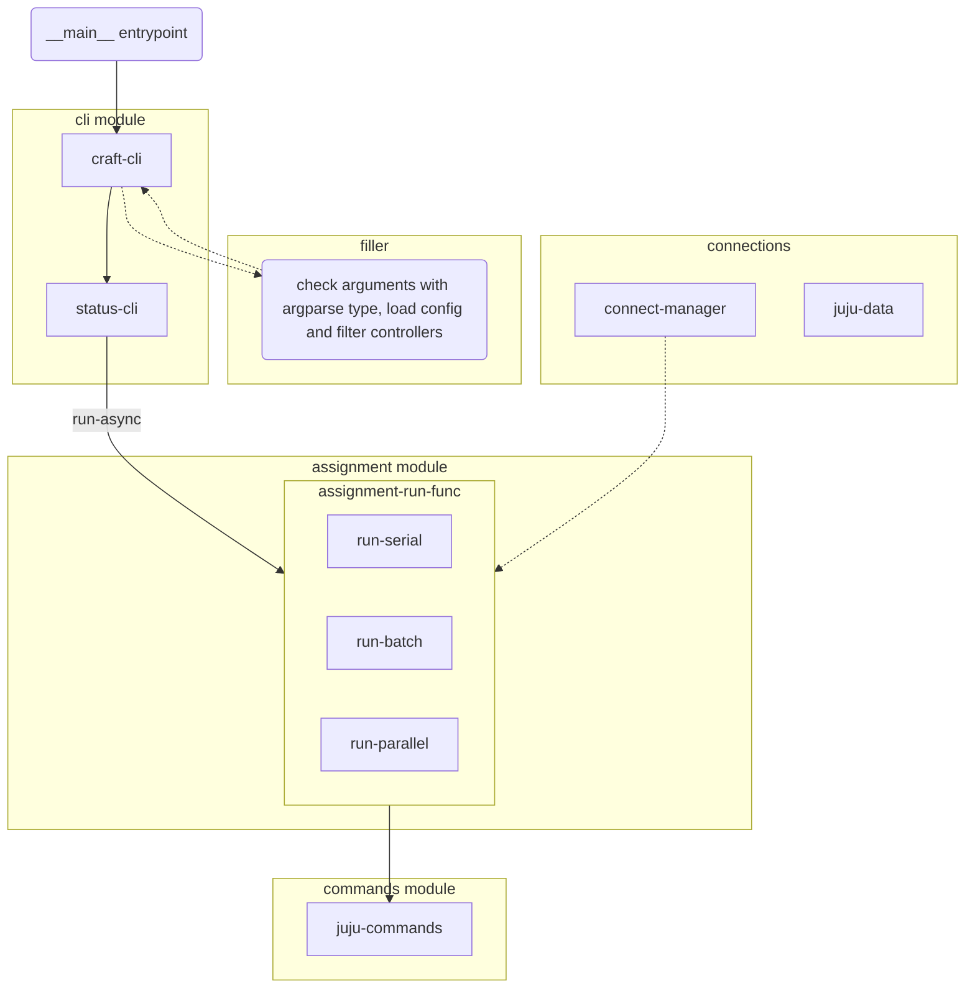

# Workflow

- **__main__ entrypoint**:
    - setup cli and exit
- **filter**
    - all filter function will put here
- **cli module**
    - Only include setup cli command, add argparse, and format output.
- **assignment module**
    - High level business logic.
    - The connection should be handled here.
    - Provides different assignment functions to run e.g., batch, serial and parallel.
- **connect manager**
    - JAAS/ssh tunnel/sshuttle connection manager
- **commands module**
    - The command should only consider how to working with the juju controller.
